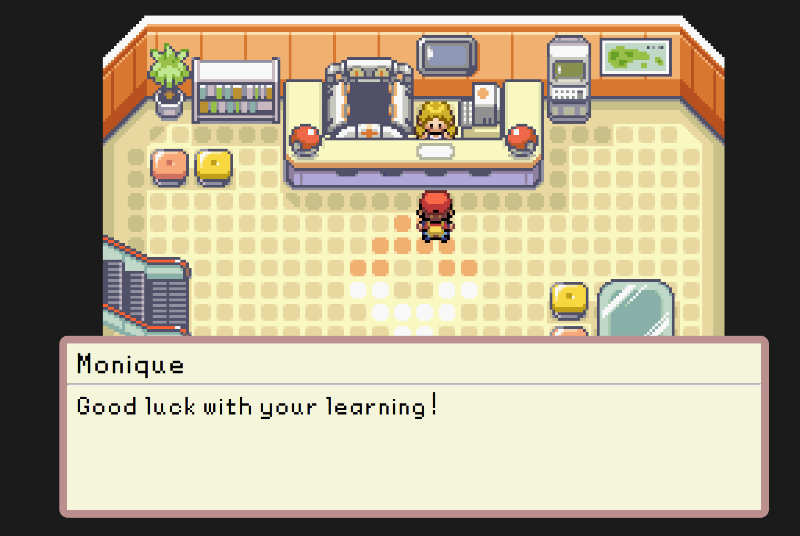
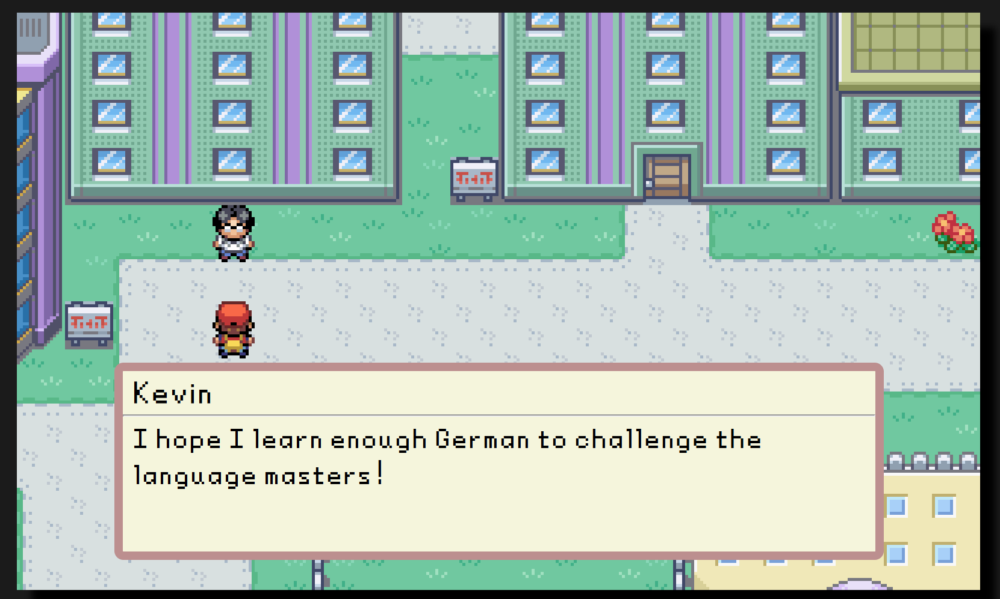
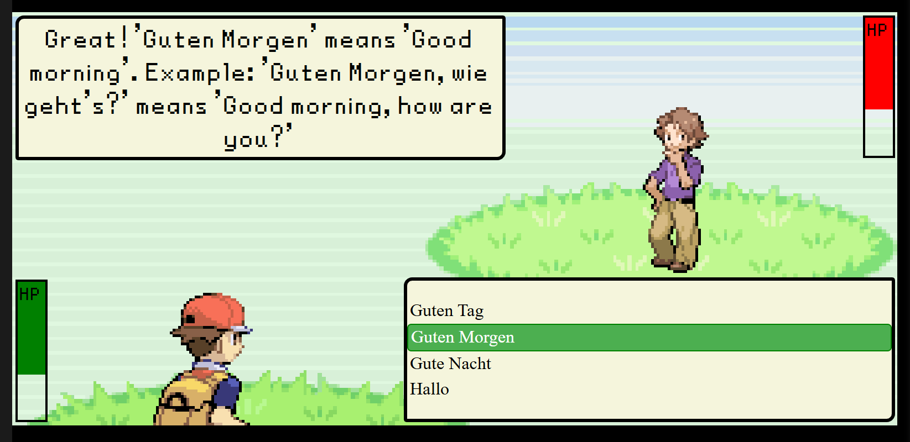

# WortQuest:Learn German Through Adventure

A browser-based RPG where you explore, interact with characters, and answer questions to practice and learn German vocabulary, grammar, and phrases.

## Features

- Explore a pixel-art world inspired by classic RPGs
- Interact with NPCs who help you learn German
- Battle using your knowledge of German vocabulary and grammar
- Visual feedback for correct/incorrect answers
- Take on a fierce challenge and power your way through be crowned as the **<u>Deutschmeister</u>**

## How to Play

- Move your character with W/A/S/D
- Press SPACE to interact with NPCs and answer questions

## Disclaimer

This game is a project for educational purposes and is not affiliated with any language institution.

I am not affiliated with the Nintendo Company, all assets in this application were taken from third party websites and not from the game itself.

Pokémon and All Respective Names, Images are Trademark &copy; of Nintendo 1996 - 2025.

## Technologies Used

- TypeScript
- Webpack

## Features

- User can walk around the map and interact with NPCs
- Upon interaction with certain NPCs may trigger a battle
- Gym/Language school setup for user to test their knowledge against instructors and professor(s)

## Setup

For installation and local development instructions, check [SETUP.md](./SETUP.md).

## In-Game Screenshots

  

  

  

---

Ready to start your German adventure? Viel Spaß beim Lernen!
