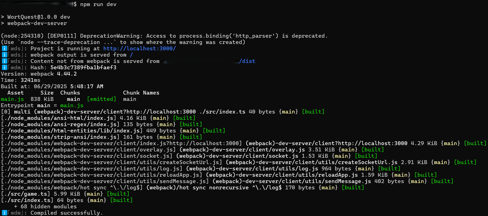

# Project Setup Instructions

This guide will help you clone, install, and run this project locally on your machine.

## 1. Prerequisites
- **PC/Laptop** (as of now*)
- **Node.js (Gallium)-v16.20.2** (required; newer versions like v24.x are not supported)
- **npm** (comes with Node.js)
- **git**

> **Works on Linux and macOS.**
> On Windows, use [WSL](https://docs.microsoft.com/en-us/windows/wsl/) for best compatibility.

If you do not have Node.js Gallium(v16.20.2) and npm installed, you can install them on Linux/macOS with:

```
curl -fsSL https://deb.nodesource.com/setup_16.x | sudo -E bash -
sudo apt-get install -y nodejs
```

Verify your Node.js version with:
```
node -v
```
It should output `v16.20.2`.

## 2. Clone the Repository

```
git clone https://github.com/SD-14/Project_WortQuest.git
cd Project_WortQuest
```
## 3. Install Dependencies

```
npm install
```

## 4. Run the Development Server

```
npm run dev
```
This will start the app on `http://localhost:3000` (or another port if specified in your terminal).

If everything is setup correctly,your server output should be similar:

<p align="center">
  
</p>

## 5. Build for Production(OPTIONAL)

Open another terminal parallely:

```
npm run build
```
The build will be output to the `dist/` directory.

## 6. Troubleshooting
- If you encounter errors, ensure your Node.js version is at least v16.*(I ran this on v18.19.0 and had no issues with running this project locally)
- Delete `node_modules` and `package-lock.json` and run `npm install` again if you have dependency issues.
- If you have custom environment variables, copy `.env.example` to `.env` and fill in the values (if such a file exists).
- If you see errors related to OpenSSL or legacy providers, ensure you are running scripts via `npm`. If you run Node.js directly, set the environment variable:

  ```
  export NODE_OPTIONS=--openssl-legacy-provider
  ```

## 7. Notes
- This project is not currently configured for GitHub Pages deployment or to be hosted on a production site. Make sure to follow the steps above to get the project running as seen in [README.md](./README.md)

---

If you have any issues, please open an issue on the repository.
